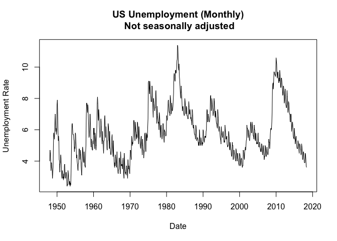

Unemployment Analysis (Time Series)
================
Dalya Adams
6/2/2018

``` r
knitr::opts_chunk$set(echo = TRUE)
library("vars", lib.loc="/Library/Frameworks/R.framework/Versions/3.3/Resources/library")
```

    ## Loading required package: MASS

    ## Loading required package: strucchange

    ## Loading required package: zoo

    ## 
    ## Attaching package: 'zoo'

    ## The following objects are masked from 'package:base':
    ## 
    ##     as.Date, as.Date.numeric

    ## Loading required package: sandwich

    ## Loading required package: urca

    ## Loading required package: lmtest

``` r
library("forecast", lib.loc="/Library/Frameworks/R.framework/Versions/3.3/Resources/library")
```

    ## Warning in as.POSIXlt.POSIXct(Sys.time()): unknown timezone 'zone/tz/2018e.
    ## 1.0/zoneinfo/America/New_York'

I chose the Monthly, non seasonally adjusted, civlian unemployment rate for the US. This dataset starts in January 1948 and runs until May of 2018. In forecasting this dataset, I will save all observations in 2017 and 2018 as the test set, and train models on all prior observations.
-------------------------------------------------------------------------------------------------------------------------------------------------------------------------------------------------------------------------------------------------------------------------------------------

I've also imported the Adjusted Monetary Base of the US from 1948 until April 2018. I plan on using this dataset in a Vector Auto Regression to posibly aid in the prediction of unemployment rates. I'm currently unsure if these two datasets are closely related, but I'm going to give it a try anyway.
-----------------------------------------------------------------------------------------------------------------------------------------------------------------------------------------------------------------------------------------------------------------------------------------------------------

``` r
unemp <- read.csv("~/Desktop/MSPA/DS 413/HW 3/UNRATENSA.csv")
tsunemp<-ts(unemp$UNRATENSA, start = c(1948,01), end = c(2018,05), frequency = 12)
#Adjusted Monetary Base
ambns <- read.csv("~/Desktop/MSPA/DS 413/HW 3/AMBNS.csv")
tsambns<-ts(ambns$AMBNS, start = c(1948,01), end = c(2018,04), frequency = 12)
```

Below we see a plot of the Monthly, US Unemployment Rate.
---------------------------------------------------------

``` r
plot(tsunemp, type= 'l', main="US Unemployment (Monthly)\n Not seasonally adjusted", ylab="Unemployment Rate", xlab = "Date")
```



Below we see the plot of the Adjusted Monetary Base. In viewing these two plots togethe, there may not be a large correlation between them, and this combination of datasets may not make the VAR more accurate than other models.
----------------------------------------------------------------------------------------------------------------------------------------------------------------------------------------------------------------------------------

``` r
plot(tsambns, type= 'l', main="US Adjusted Monetary Base (Monthly)\n Not seasonally adjusted", ylab="Adj Monetary Base", xlab = "Date")
```


For this prediction, first we will separate our datasets into training and test sets. We are removing May's observation from the unemployment dataset to ensure both datasets are the same length when utilizing the VAR. The training data starts on January 1948 and end on December 2016. The test sets is form Jan 2017 to April of 2018.
---------------------------------------------------------------------------------------------------------------------------------------------------------------------------------------------------------------------------------------------------------------------------------------------------------------------------------------------

``` r
unemp.train<-unemp[1:828,]
unemp.test<-unemp[829:844,]

ambns.train<-ambns[1:828,]
ambns.test<-ambns[829:844,]
```

``` r
tsunemp.train<-ts(unemp.train$UNRATENSA, start = c(1948,01), end = c(2016,12), frequency = 12)
tsunemp.test<-ts(unemp.test$UNRATENSA, start = c(2017,01), end = c(2018,04), frequency = 12)

#tsambns.train<-ts(ambns.train$AMBNS, start = c(1948,01), end = c(2016,12), frequency = 12)
#tsambns.test<-ts(ambns.test$AMBNS, start = c(2017,01), end = c(2018,04), frequency = 12)
```

We will attempt to predict 16 months out, using different forecasting methods. These are: ETS, ARIMA, VAR, and a NNAR
---------------------------------------------------------------------------------------------------------------------

### Exponential Smoothing (ETS):

``` r
plot(forecast(ets(tsunemp.train),h=16))

#compared to test set
lines(tsunemp.test, col = "black")
legend("topleft", lty = 1, col = c( "black","blue"), 
       legend = c("Data", "ETS Forecast"))
```


``` r
#Summary
funemp<-forecast(ets(tsunemp.train),h=16)
summary(funemp)
```

    ## 
    ## Forecast method: ETS(A,A,A)
    ## 
    ## Model Information:
    ## ETS(A,A,A) 
    ## 
    ## Call:
    ##  ets(y = tsunemp.train) 
    ## 
    ##   Smoothing parameters:
    ##     alpha = 0.9223 
    ##     beta  = 1e-04 
    ##     gamma = 0.0775 
    ## 
    ##   Initial states:
    ##     l = 2.9372 
    ##     b = 0.0015 
    ##     s=-0.4374 -0.5496 -0.7985 -0.3915 -0.1023 0.3241
    ##            0.4514 -0.0711 -0.0314 0.3211 0.7824 0.5028
    ## 
    ##   sigma:  0.2535
    ## 
    ##      AIC     AICc      BIC 
    ## 3324.434 3325.190 3404.657 
    ## 
    ## Error measures:
    ##                        ME     RMSE       MAE         MPE    MAPE      MASE
    ## Training set 0.0005886676 0.253465 0.1925846 -0.02825114 3.56855 0.2193593
    ##                   ACF1
    ## Training set 0.2216622
    ## 
    ## Forecasts:
    ##          Point Forecast    Lo 80    Hi 80    Lo 95    Hi 95
    ## Jan 2017       5.252816 4.927987 5.577644 4.756033 5.749598
    ## Feb 2017       5.225697 4.783777 5.667616 4.549840 5.901554
    ## Mar 2017       5.108539 4.574598 5.642479 4.291947 5.925130
    ## Apr 2017       4.656499 4.044198 5.268800 3.720065 5.592932
    ## May 2017       4.732893 4.051165 5.414621 3.690280 5.775506
    ## Jun 2017       5.123356 4.378632 5.868081 3.984399 6.262314
    ## Jul 2017       5.141759 4.338953 5.944564 3.913974 6.369544
    ## Aug 2017       4.854706 3.997736 5.711677 3.544083 6.165330
    ## Sep 2017       4.574328 3.666407 5.482250 3.185782 5.962875
    ## Oct 2017       4.477583 3.521411 5.433755 3.015244 5.939922
    ## Nov 2017       4.457404 3.455292 5.459516 2.924805 5.990002
    ## Dec 2017       4.518598 3.472551 5.564645 2.918808 6.118388
    ## Jan 2018       5.271421 4.175995 6.366847 3.596111 6.946730
    ## Feb 2018       5.244302 4.108527 6.380077 3.507285 6.981319
    ## Mar 2018       5.127144 3.952397 6.301891 3.330524 6.923764
    ## Apr 2018       4.675104 3.462628 5.887579 2.820783 6.529425

``` r
#accuracy
accuracy(funemp,tsunemp.test)
```

    ##                         ME      RMSE       MAE          MPE     MAPE
    ## Training set  0.0005886676 0.2534650 0.1925846  -0.02825114  3.56855
    ## Test set     -0.5963842528 0.6359992 0.5963843 -14.21816282 14.21816
    ##                   MASE      ACF1 Theil's U
    ## Training set 0.2193593 0.2216622        NA
    ## Test set     0.6792986 0.6496732  2.169994

### ARIMA:

### The forecasts from the ARIMA model are visually so similar to the test set that I am separating the plots so that the ARIMA model's forecasts can be viewed better.

``` r
plot(forecast(auto.arima(tsunemp.train),h=16))
legend("topleft", lty = 1, col = c( "black","blue"), 
     legend = c("Data", "ARIMA"))
```


``` r
par(mfrow=c(2,1))
plot(forecast(auto.arima(tsunemp.train),h=16))
#legend("topleft", lty = 1, col = c( "black","blue"), 
#     legend = c("Data", "ARIMA"))


#compared to test set
plot(tsunemp.train, col="black", type="l", main="US Unemployment", ylab="Unemp")
lines(tsunemp.test, col = "red", type="l")
```


``` r
#legend("topleft", lty = 1, col = c( "black","red"), 
#     legend = c("Data", "Test Set"))
```

``` r
#summary of ARIMA model

farima<-forecast(auto.arima(tsunemp.train),h=16)
summary(farima)
```

    ## 
    ## Forecast method: ARIMA(4,1,4)(1,0,0)[12]
    ## 
    ## Model Information:
    ## Series: tsunemp.train 
    ## ARIMA(4,1,4)(1,0,0)[12] 
    ## 
    ## Coefficients:
    ##          ar1     ar2     ar3      ar4      ma1     ma2      ma3     ma4
    ##       0.7316  0.1035  0.5940  -0.7674  -0.6992  0.0811  -0.7337  0.8860
    ## s.e.  0.0333  0.0408  0.0373   0.0309   0.0277  0.0233   0.0214  0.0285
    ##         sar1
    ##       0.8619
    ## s.e.  0.0190
    ## 
    ## sigma^2 estimated as 0.0729:  log likelihood=-93.56
    ## AIC=207.11   AICc=207.38   BIC=254.29
    ## 
    ## Error measures:
    ##                         ME      RMSE       MAE        MPE     MAPE
    ## Training set -0.0004607248 0.2683725 0.2054697 0.04052264 3.799909
    ##                   MASE      ACF1
    ## Training set 0.2340359 0.0506187
    ## 
    ## Forecasts:
    ##          Point Forecast    Lo 80    Hi 80        Lo 95    Hi 95
    ## Jan 2017       4.884522 4.538493 5.230551  4.355316418 5.413728
    ## Feb 2017       4.899602 4.402272 5.396933  4.139001156 5.660204
    ## Mar 2017       4.694408 4.037445 5.351371  3.689670144 5.699147
    ## Apr 2017       4.303148 3.515345 5.090952  3.098306748 5.507990
    ## May 2017       4.180221 3.250377 5.110064  2.758147327 5.602294
    ## Jun 2017       4.580332 3.488641 5.672023  2.910734093 6.249930
    ## Jul 2017       4.563540 3.325828 5.801252  2.670623403 6.456457
    ## Aug 2017       4.518008 3.129002 5.907014  2.393707197 6.642310
    ## Sep 2017       4.266165 2.725292 5.807039  1.909602842 6.622728
    ## Oct 2017       4.205894 2.535277 5.876511  1.650905523 6.760882
    ## Nov 2017       3.995095 2.201412 5.788779  1.251892734 6.738298
    ## Dec 2017       4.040519 2.135499 5.945540  1.127041395 6.953997
    ## Jan 2018       4.423440 2.320097 6.526783  1.206653731 7.640226
    ## Feb 2018       4.478377 2.196177 6.760577  0.988053341 7.968700
    ## Mar 2018       4.276651 1.816383 6.736920  0.513995260 8.039307
    ## Apr 2018       3.987442 1.374214 6.600670 -0.009145247 7.984030

``` r
#accuracy ARIMA
accuracy(farima, tsunemp.test)
```

    ##                         ME      RMSE       MAE         MPE     MAPE
    ## Training set -0.0004607248 0.2683725 0.2054697  0.04052264 3.799909
    ## Test set     -0.0873354246 0.1555151 0.1284473 -2.26364038 3.104529
    ##                   MASE      ACF1 Theil's U
    ## Training set 0.2340359 0.0506187        NA
    ## Test set     0.1463051 0.2232277 0.5020781

### Vector Autoregression (VAR):

``` r
unadj<-data.frame(unemp=unemp.train$UNRATENSA, adj=ambns.train$AMBNS)
tsunadj<-ts(unadj, start = c(1948,01), end = c(2016,12), frequency = 12)

test.unadj<-data.frame(unemp=unemp.test$UNRATENSA, adj=ambns.test$AMBNS)
tsunadj.test<-ts(test.unadj, start = c(1948,01), end = c(2016,12), frequency = 12)
```

``` r
VARselect(tsunadj, lag.max = 8, type = "const")$selection
```

    ## AIC(n)  HQ(n)  SC(n) FPE(n) 
    ##      8      8      8      8

``` r
VARselect(tsunadj, lag.max = 100, type = "const")$selection
```

    ## AIC(n)  HQ(n)  SC(n) FPE(n) 
    ##     86     25     15     86

``` r
tsvar<-VAR(tsunadj, p=15, type="const")
serial.test(tsvar, lags.pt = 15, type="PT.asymptotic")
```

    ## 
    ##  Portmanteau Test (asymptotic)
    ## 
    ## data:  Residuals of VAR object tsvar
    ## Chi-squared = 98.171, df = 0, p-value < 2.2e-16

After attempting to ensure that the residuals from the VAR are uncorrelated, using the Portmanteau test, we rejet the null hypothesis using every p from 1 to 86 and every lags.pt from 1:100. At no point in this do we fail to reject the null hypothesis of uncorrelated residuals.
--------------------------------------------------------------------------------------------------------------------------------------------------------------------------------------------------------------------------------------------------------------------------------------

I'll go ahead with the VAR prediction but it is not one that I would use in this instance.
------------------------------------------------------------------------------------------

``` r
summary(tsvar)
```

    ## 
    ## VAR Estimation Results:
    ## ========================= 
    ## Endogenous variables: unemp, adj 
    ## Deterministic variables: const 
    ## Sample size: 813 
    ## Log Likelihood: -3913.702 
    ## Roots of the characteristic polynomial:
    ## 1.001 0.9919 0.9919 0.9893 0.9893 0.9832 0.9832 0.9556 0.9556 0.9554 0.9554 0.9463 0.9463 0.9452 0.9156 0.9156 0.9008 0.9008 0.8971 0.8971 0.8747 0.8443 0.8443 0.8266 0.8266 0.8042 0.8042 0.6489 0.5311 0.4911
    ## Call:
    ## VAR(y = tsunadj, p = 15, type = "const")
    ## 
    ## 
    ## Estimation results for equation unemp: 
    ## ====================================== 
    ## unemp = unemp.l1 + adj.l1 + unemp.l2 + adj.l2 + unemp.l3 + adj.l3 + unemp.l4 + adj.l4 + unemp.l5 + adj.l5 + unemp.l6 + adj.l6 + unemp.l7 + adj.l7 + unemp.l8 + adj.l8 + unemp.l9 + adj.l9 + unemp.l10 + adj.l10 + unemp.l11 + adj.l11 + unemp.l12 + adj.l12 + unemp.l13 + adj.l13 + unemp.l14 + adj.l14 + unemp.l15 + adj.l15 + const 
    ## 
    ##             Estimate Std. Error t value Pr(>|t|)    
    ## unemp.l1   1.071e+00  3.495e-02  30.635  < 2e-16 ***
    ## adj.l1     8.574e-04  3.550e-04   2.415  0.01596 *  
    ## unemp.l2   1.093e-01  5.170e-02   2.115  0.03476 *  
    ## adj.l2    -7.308e-04  6.182e-04  -1.182  0.23751    
    ## unemp.l3  -2.589e-01  4.329e-02  -5.980 3.39e-09 ***
    ## adj.l3     2.612e-04  6.529e-04   0.400  0.68923    
    ## unemp.l4   4.493e-02  3.701e-02   1.214  0.22517    
    ## adj.l4    -2.876e-04  6.569e-04  -0.438  0.66162    
    ## unemp.l5   1.026e-01  3.691e-02   2.779  0.00558 ** 
    ## adj.l5    -1.387e-04  6.624e-04  -0.209  0.83420    
    ## unemp.l6  -1.691e-01  3.708e-02  -4.560 5.94e-06 ***
    ## adj.l6     1.710e-04  6.650e-04   0.257  0.79718    
    ## unemp.l7   9.660e-02  3.745e-02   2.579  0.01009 *  
    ## adj.l7    -5.488e-04  6.674e-04  -0.822  0.41111    
    ## unemp.l8  -2.856e-02  3.761e-02  -0.759  0.44786    
    ## adj.l8     2.355e-05  6.715e-04   0.035  0.97203    
    ## unemp.l9  -8.530e-02  3.743e-02  -2.279  0.02295 *  
    ## adj.l9     1.049e-03  6.726e-04   1.560  0.11928    
    ## unemp.l10  3.232e-03  3.703e-02   0.087  0.93048    
    ## adj.l10   -8.329e-04  6.757e-04  -1.233  0.21802    
    ## unemp.l11  9.797e-02  3.685e-02   2.659  0.00800 ** 
    ## adj.l11    4.868e-04  6.783e-04   0.718  0.47317    
    ## unemp.l12  6.873e-01  3.695e-02  18.602  < 2e-16 ***
    ## adj.l12   -2.925e-04  6.811e-04  -0.429  0.66769    
    ## unemp.l13 -7.905e-01  4.332e-02 -18.249  < 2e-16 ***
    ## adj.l13   -2.258e-04  6.777e-04  -0.333  0.73912    
    ## unemp.l14 -1.185e-01  5.164e-02  -2.296  0.02196 *  
    ## adj.l14    5.215e-05  6.597e-04   0.079  0.93701    
    ## unemp.l15  2.095e-01  3.466e-02   6.044 2.33e-09 ***
    ## adj.l15    1.522e-04  3.888e-04   0.391  0.69556    
    ## const      1.634e-01  3.971e-02   4.114 4.30e-05 ***
    ## ---
    ## Signif. codes:  0 '***' 0.001 '**' 0.01 '*' 0.05 '.' 0.1 ' ' 1
    ## 
    ## 
    ## Residual standard error: 0.2709 on 782 degrees of freedom
    ## Multiple R-Squared: 0.975,   Adjusted R-squared: 0.974 
    ## F-statistic:  1016 on 30 and 782 DF,  p-value: < 2.2e-16 
    ## 
    ## 
    ## Estimation results for equation adj: 
    ## ==================================== 
    ## adj = unemp.l1 + adj.l1 + unemp.l2 + adj.l2 + unemp.l3 + adj.l3 + unemp.l4 + adj.l4 + unemp.l5 + adj.l5 + unemp.l6 + adj.l6 + unemp.l7 + adj.l7 + unemp.l8 + adj.l8 + unemp.l9 + adj.l9 + unemp.l10 + adj.l10 + unemp.l11 + adj.l11 + unemp.l12 + adj.l12 + unemp.l13 + adj.l13 + unemp.l14 + adj.l14 + unemp.l15 + adj.l15 + const 
    ## 
    ##           Estimate Std. Error t value Pr(>|t|)    
    ## unemp.l1   0.45641    3.57205   0.128 0.898362    
    ## adj.l1     1.40393    0.03628  38.694  < 2e-16 ***
    ## unemp.l2   2.76494    5.28397   0.523 0.600935    
    ## adj.l2    -0.53457    0.06318  -8.461  < 2e-16 ***
    ## unemp.l3  -5.62290    4.42405  -1.271 0.204113    
    ## adj.l3     0.31672    0.06673   4.746 2.46e-06 ***
    ## unemp.l4   3.85019    3.78282   1.018 0.309083    
    ## adj.l4    -0.20469    0.06714  -3.049 0.002374 ** 
    ## unemp.l5   2.75909    3.77180   0.732 0.464689    
    ## adj.l5     0.09596    0.06769   1.418 0.156699    
    ## unemp.l6  -4.58365    3.78977  -1.209 0.226845    
    ## adj.l6    -0.01839    0.06796  -0.271 0.786741    
    ## unemp.l7   0.34108    3.82759   0.089 0.929016    
    ## adj.l7    -0.10400    0.06820  -1.525 0.127695    
    ## unemp.l8   1.88039    3.84328   0.489 0.624791    
    ## adj.l8    -0.07501    0.06863  -1.093 0.274767    
    ## unemp.l9  -1.77122    3.82558  -0.463 0.643498    
    ## adj.l9     0.15634    0.06874   2.274 0.023218 *  
    ## unemp.l10  3.32236    3.78448   0.878 0.380273    
    ## adj.l10    0.01715    0.06905   0.248 0.803875    
    ## unemp.l11 -3.29366    3.76559  -0.875 0.382021    
    ## adj.l11    0.05117    0.06932   0.738 0.460615    
    ## unemp.l12 -1.84312    3.77617  -0.488 0.625621    
    ## adj.l12   -0.23925    0.06961  -3.437 0.000619 ***
    ## unemp.l13  4.23418    4.42687   0.956 0.339129    
    ## adj.l13    0.32200    0.06926   4.649 3.91e-06 ***
    ## unemp.l14 -1.56665    5.27734  -0.297 0.766649    
    ## adj.l14   -0.26696    0.06742  -3.960 8.19e-05 ***
    ## unemp.l15  0.13444    3.54200   0.038 0.969732    
    ## adj.l15    0.08021    0.03974   2.019 0.043855 *  
    ## const     -4.82411    4.05793  -1.189 0.234875    
    ## ---
    ## Signif. codes:  0 '***' 0.001 '**' 0.01 '*' 0.05 '.' 0.1 ' ' 1
    ## 
    ## 
    ## Residual standard error: 27.69 on 782 degrees of freedom
    ## Multiple R-Squared: 0.9992,  Adjusted R-squared: 0.9992 
    ## F-statistic: 3.293e+04 on 30 and 782 DF,  p-value: < 2.2e-16 
    ## 
    ## 
    ## 
    ## Covariance matrix of residuals:
    ##          unemp       adj
    ## unemp  0.07339  -0.04202
    ## adj   -0.04202 766.50576
    ## 
    ## Correlation matrix of residuals:
    ##           unemp       adj
    ## unemp  1.000000 -0.005603
    ## adj   -0.005603  1.000000

``` r
plot(forecast(tsvar,h=16))
```


NNAR:
-----

``` r
nnt<-nnetar(tsunemp.train)
```

``` r
plot(forecast(nnt, h=16))
lines(tsunemp.test, col="black")
legend("topleft", lty = 1, col = c( "black","blue"), 
       legend = c("Data", "NNAR"))
```


``` r
accuracy(forecast(nnt, h=16), tsunemp.test)
```

    ##                         ME      RMSE        MAE         MPE     MAPE
    ## Training set -0.0003325843 0.1119314 0.08555542 -0.08365157 1.606618
    ## Test set     -0.2325238622 0.2688802 0.24713341 -5.67439146 5.960853
    ##                    MASE        ACF1 Theil's U
    ## Training set 0.09745006 -0.04637537        NA
    ## Test set     0.28149200  0.46773414 0.9188604

In the end, we were able to run an ETS model, an ARIMA model and a NNAR model. Below we will review teh accuracy statsitcs for each of these and choose the model that was the most accurate.
---------------------------------------------------------------------------------------------------------------------------------------------------------------------------------------------

### ETS Accuracy

``` r
accuracy(funemp,tsunemp.test)
```

    ##                         ME      RMSE       MAE          MPE     MAPE
    ## Training set  0.0005886676 0.2534650 0.1925846  -0.02825114  3.56855
    ## Test set     -0.5963842528 0.6359992 0.5963843 -14.21816282 14.21816
    ##                   MASE      ACF1 Theil's U
    ## Training set 0.2193593 0.2216622        NA
    ## Test set     0.6792986 0.6496732  2.169994

### ARIMA Accuracy

``` r
accuracy(farima, tsunemp.test)
```

    ##                         ME      RMSE       MAE         MPE     MAPE
    ## Training set -0.0004607248 0.2683725 0.2054697  0.04052264 3.799909
    ## Test set     -0.0873354246 0.1555151 0.1284473 -2.26364038 3.104529
    ##                   MASE      ACF1 Theil's U
    ## Training set 0.2340359 0.0506187        NA
    ## Test set     0.1463051 0.2232277 0.5020781

### NNAR Accuracy

``` r
accuracy(forecast(nnt, h=16), tsunemp.test)
```

    ##                         ME      RMSE        MAE         MPE     MAPE
    ## Training set -0.0003325843 0.1119314 0.08555542 -0.08365157 1.606618
    ## Test set     -0.2325238622 0.2688802 0.24713341 -5.67439146 5.960853
    ##                    MASE        ACF1 Theil's U
    ## Training set 0.09745006 -0.04637537        NA
    ## Test set     0.28149200  0.46773414 0.9188604

The ARIMA model was the most accurate from the 3 different models.
------------------------------------------------------------------
